# Agencia

## Contenido
- [Instalacion de Docker](#instalacion-docker)

### Instalacion Docker

1. Instalamos previamente *WSL 2*, es recomendable para la integracion con Linux y Docker. Pulsamos en Ubuntu para que instale la version mas reciente de *WSL*.
[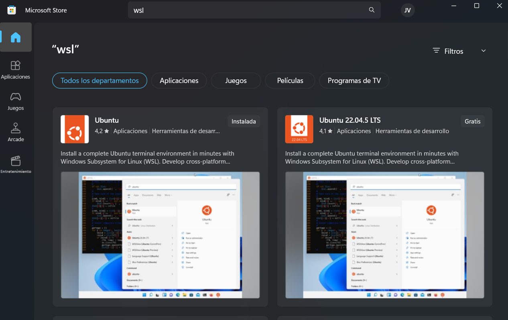]()

2. Instalamos Docker, [pagina oficial](https://docs.docker.com/desktop/install/windows-install/).  
[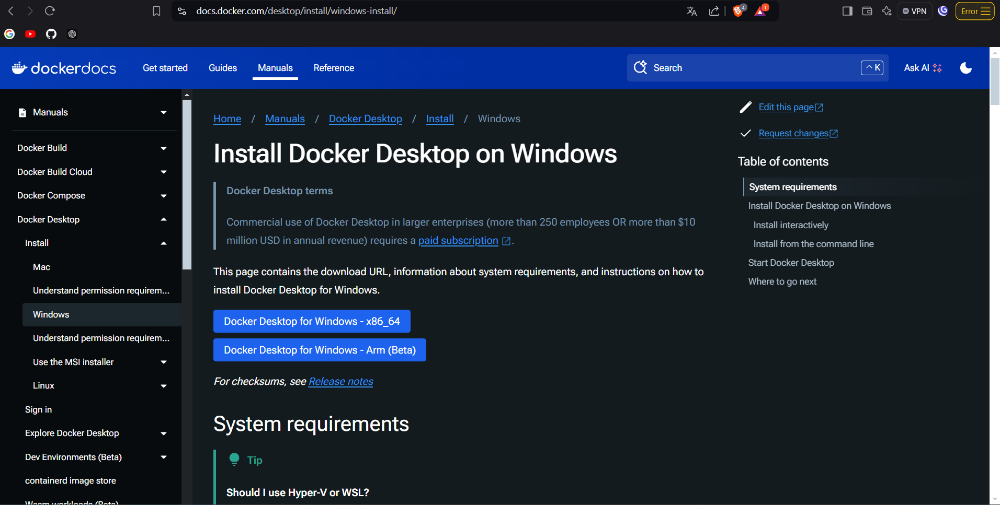]()

3. Una vez instalado vamos a una terminal o a *VSCode* y ejecutamos un *docker compose up -d*, para instalar las imagenes de *MYSql* y los contenedores que contendra los 3 SGBDR.
[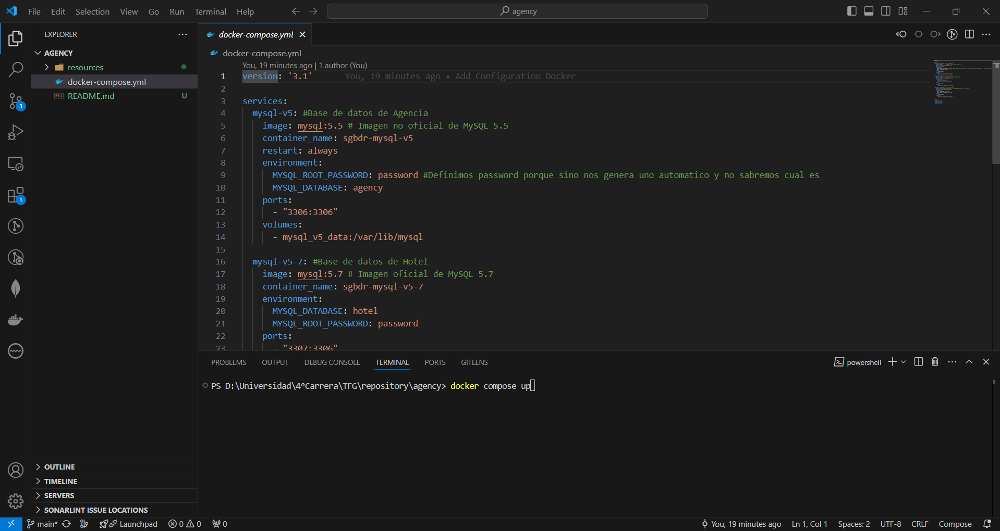]()

4. Vemos que se han levantado correctamente el contenedor con el comando *docker ps* deberian aparecer los 3 contenedores.
[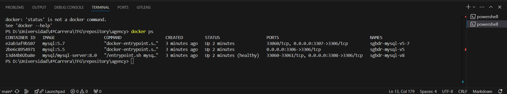]()
[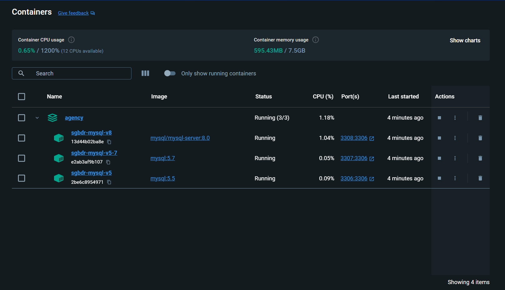]()

5. Instalar DBeaver que sera nuestra interfaz grafica para gestionar BBDD. 
[Pagina](https://dbeaver.io/download/)
[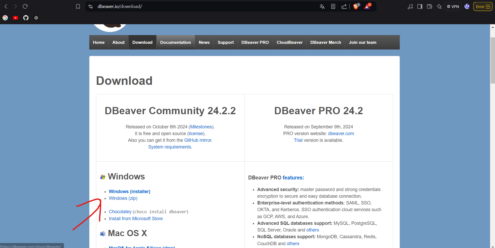]()

6. Una vez instalado, procederemos a conectarnos a nuestras BBDDs. Creamos una conexion, pulsamos *Mysql* y nos pedira que instalemos los drivers(Le damos a aceptar evidentemente).
[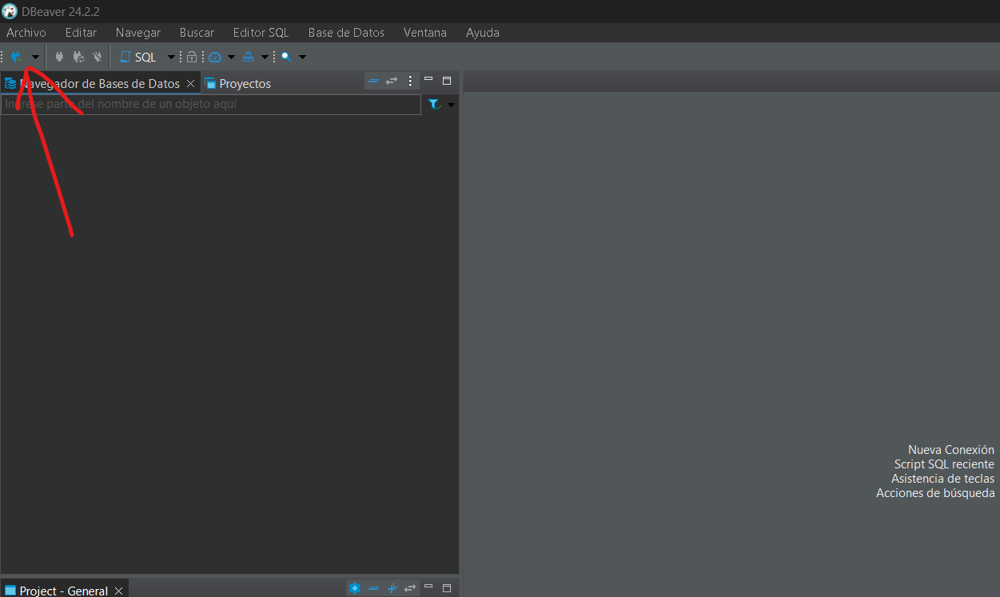]()

7. Configuramos la conexion y probamos la conexion.
[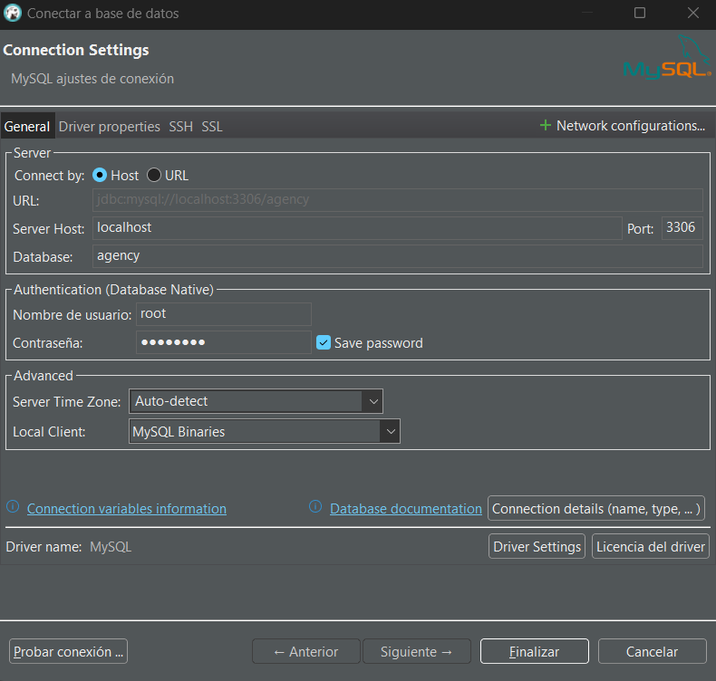]()

8. Asi hasta tener las 3 BBDD configuradas.
A la hora de configurar la BBDD nos dara un error 'Public Key', para solvertalo tendremos que irnos a Driver Settings y poner 
allowPublicKeyRetrieval: true
useSSL: false
[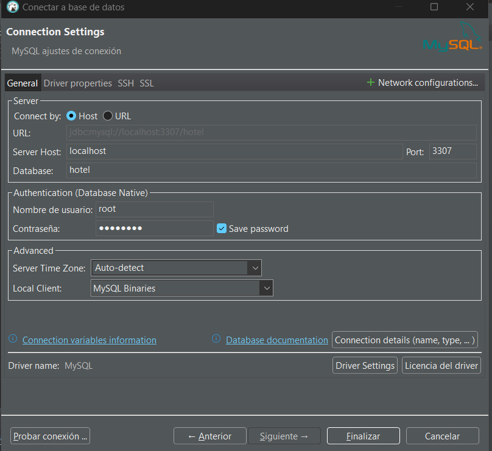]()
[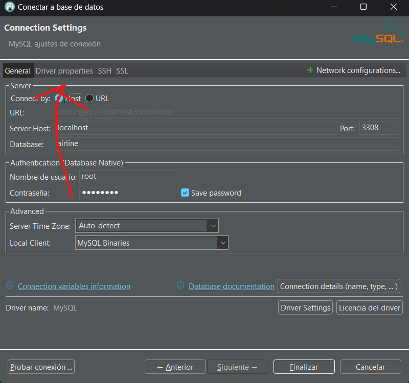]()

9. Asi se deberia ver nuestros 3 SGBDR con 3 puertos diferentes
[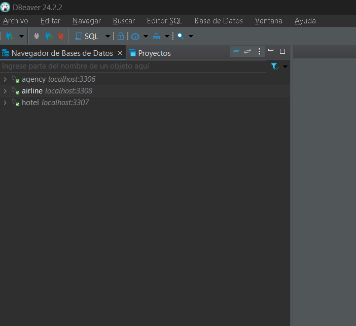]()

